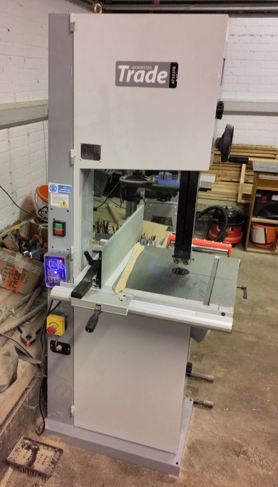

# Axminster Bandsaw

An Axminster SBW4300B bandsaw.

## Essential Information

- Location: South Basement Workshop
- Responsible Person(s): Ben Shaw, Dan Nixon
- Induction Required: Yes

## Usage notes

The manual for this machine can be found [here](./manual.pdf).

You will be expected to demonstrate the following competencies before gaining RFID access to this machine:

- Understand how the electronic brake operates and the need to let it do its thing after hitting stop.
- Have an appreciation for appropriate (goggles, hearing protection) and inappropriate (gloves) PPE when using the bandsaw.
- Know how to move the fence and change its orientation.
- Understand how to adjust the blade guides and the importance of not having them higher than necessary.
- Know how to stand when using the bandsaw (i.e. not leaning into it).
- Know to never be pushing material with your hand in line with the blade - always to the side, use a push stick etc.
- Understand appropriate materials to cut on the bandsaw - and inappropriate ones. Appreciate how to handle different materials (e.g. wear a mask for MDF and other dusty things).
- Know the appropriate types of cut which can be made on the bandsaw (OK for reasonably thick, reasonably long cuts, bad for tight corners - use the scroll saw).
- Understand the need to keep the blade tensioned, and know how to adjust the tension.
- Understand how and why to use the cross-cut sled (prevents binding on the fence when cross-cutting).
- Know to not start/stop the machine with the workpiece in contact with the blade.
- Understand how to cut thin materials - use a sacrificial board below to prevent tear-out.
- Know how to use dust/chip extraction when necessary.
