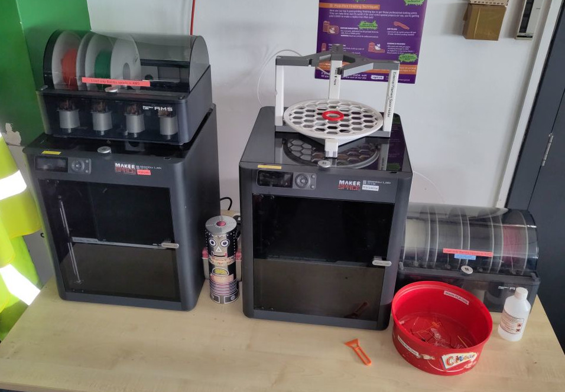

# Bambu Lab P1S

Two [Bambu Lab P1S](https://bambulab.com/en-gb/p1?product=p1s)es, Hakurei and Kirisame.
Very good, fast FDM 3D printers.

## Essential Information

- Location: Ground Floor Workshop
- Responsible Person(s): Dan Nixon
- Induction Required: Yes
- Build volume: 256mm x 256mm x 256mm

|Printer |Nozzle size|LAN access code|Filament Options|
|--------|-----------|---------------|----------------|
|Hakurei |0.4mm      |22497498       |AMS compatible spools only|
|Kirisame|0.4mm      |29623040       |AMS compatible spools or up to 3 Kg spools via top spool caddy|

## Usage notes

> **It is not permitted to leave this (or any other) 3D printer running whilst Maker Space is unoccupied!**

> **3D printer filament supplied by Maker Space must be paid for. See [3D Printer Filament](../../using_the_space/3d_printer_filament.md) for details.**

## Useful links

- [Bambu Lab wiki](https://wiki.bambulab.com/en/home)

## Induction checklist

- General info
    - Filament availability, compatible filaments, price for Maker Space filament, options for using own filament
    - The requirement to not leave the machine running unattended
    - Do not remove the memory cards unless you want to get timelapse footage
- Start up procedure
    - Power switch location
    - Verify no obstacles inside printer
- Bambu Studio
    - Initial setup (if appropriate)
    - Adding our printers (use codes above, not the printer menu)
    - Configuring a basic print job
    - The requirement to ensure the AMS is synchronised
- Filament loading
    - General filament handling, storage, the requirement to secure the loose end
    - Loading via the AMS
    - Loading vis the external spool
- Start of job
    - The ability to skip full bed levelling
    - Build plate cleaning
    - Check for correct build plate seating
    - The requirement to observe the start of job and first layer
- Fault handling
    - Where to see fault codes in Bambu Studio
    - The requirement to not attempt to maintain the printer
- End of job
    - Removal of parts from bed
    - Ensure printer is left clean, serviceable and powered off
