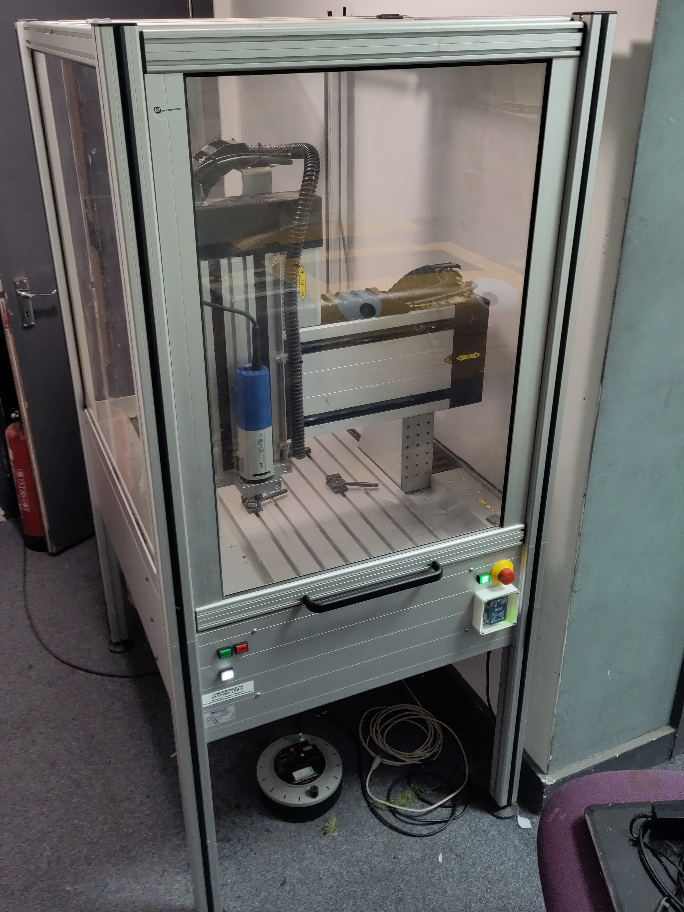

# CNC Mill (Ibuki)

A Isel GFM 4433 that we aquired with a faulty control system from Monkseaton High School (which closed)
Upgraded with a [RP23CNC](https://github.com/phil-barrett/RP23CNC).

It has a usable bed size of approximately 500x350mm.

## Essential Information

- Location: Ground Floor Corridor
- Responsible Person(s): Dan Nixon
- Induction Required: Yes

## Useful Information

- Spindle fitted with OZ6A (aka EOC6) collet holder
    - We have 6mm and 1/8" (3.175mm) collets - the 1/8" can take 3mm toolbits
    - More collets incl 1/4" currently being sourced
- Use the GRBL dialect of GCode when generating toolpaths
- USB connection to PC/laptop - use a GCode communications tool such as gSender

## Induction checklist

- Turning on machine with fob
- Panel controls
- gSender setup
    - jogging
    - axis zero
    - any machine specific gcode
- Clamping options
- Changing tools
- Turning off machine
- The need to keep the machine tidy
- Please note, machine does not enjoy alcoholic drinks.

