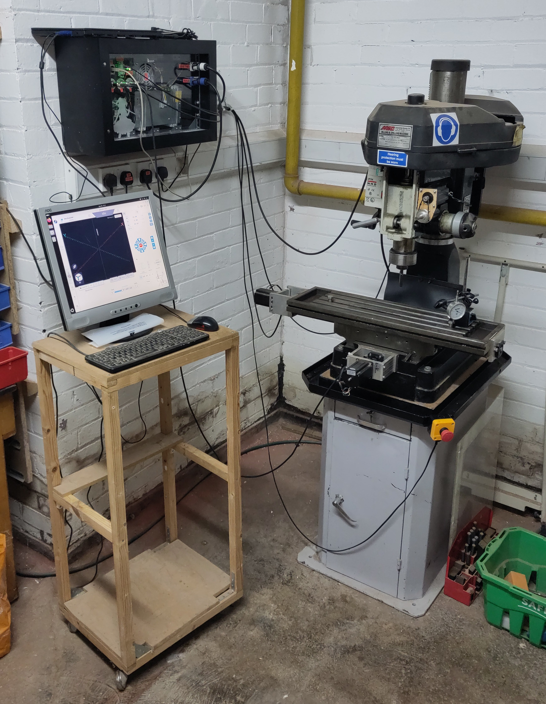

# CNC Mill

An RF30 clone round-column mill that has been converted from an imperial manual mill to a CNC ballscrew conversion.

## Essential Information

- Location: South Basement Workshop
- Responsible Person(s): David Pye, Dan Nixon
- Induction Required: Yes

## Details

CNC hardware:

* PC (mill PC) running Ubuntu and gSender
* PicoCNC board running GRBLhal running on a RP2040
* 48V stepper drivers driving the 3 axis stepper motors
* Emergency stop and standard issue access controller

A few things to be aware of:
 
 * It does not have limit switches, nor any means of automatic homing
 * Spindle motor control is manual and not controllable via GCode
 * You do not need to open the laptop, just turn the switch labelled "Mill Computer" on and the laptop will boot automatically

The axes are reasonably well calibrated now, but please do offer feedback if you notice any errors.

Further information about the conversion can be found [here](https://github.com/MakerSpaceNewcastle/Komachi), including settings for gSender and GRBLhal.
