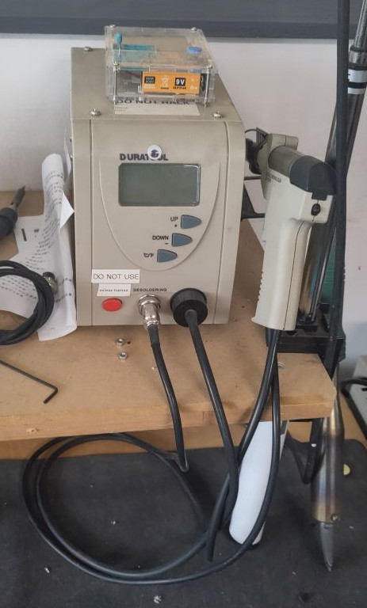

# Duratool Desolder Station

The Desolder Station is mainly for desoldering through hole components.
It is particularly great at removing solder from plated through holes where the copper track is on both sides of the board and the hole itself is also metal.

It may have other uses, but no it is not designed to suck anything but solder.
It is also not that ideal for surface mount, as the components can end up heat damaged or sucked up and jammed inside the nozzle!

## Essential Information

- Location: Ground Floor Workshop
- Responsible Person(s): Jon Davies
- Induction Required: No

## How to use the tool

1. Press the red power button on the front of the base
1. Set the 'C/F' temperature mode to Celsius
1. Start with a temperature setting of 350c
   (The iron will take a few minutes to get up to temperature - be patient) :)
1. Place the hole of the iron over the joint to be desoldered
1. Hold the iron still for two seconds (until the solder begins to melt)
1. Waggle the iron side to side for two seconds (to thoroughly melt the solder)
1. Press the trigger and continue to waggle for a further second
   (The air pump activates and draws away the solder)
1. Remove the iron from the solder joint
   (Solder has now gone)
1. Repeat steps 4 to 8 for several solder jionts
1. Clean the iron tip in the tip-cleaning brass
   (Do this regularly to keep a clean healthy tip and a good thermal interface)
1. Repeat steps 4 to 10 for your session
1. Clean the tip one final time
1. Stow the iron in the holder
1. Turn off the power

## Troubleshooting & Tips

### Solder slow to melt (more than five seconds)

- For larger components, it may be necessary to increase the temperature to 375c.
- For ground planes, it may be necessary to increase the temperature to 400c

### Loss of Suction

The filter in the iron/base has become clogged.

1. Stop using the desoldering tool
2. Stick a notice on the base to indicate the tool is in need of TLC 
3. Notify a maintainer

### I am experienced and impatient!

Ok... you can speed up your desoldering session with an increased risk of component damage.
Increase the temperature to 400c but work fast on large components and really fast on small components.
