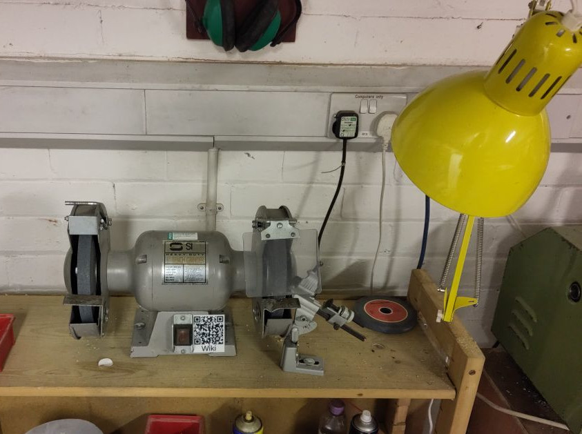

# Large Bench Grinder

This is a medium size grinder with coarse and fine wheels.

It previously suffered from excessive vibration which has been largely solved by truing the wheel flanges and dressing both wheels

It is suitable for sharpening lathe tools and other steel tools.

Please DO NOT attempt to grind soft metals such as alloy, wood etc as this clogs the carborundum structure and can damage the wheels.

Also DO NOT routinely grind on the side of the wheels as this can lead to damage and potentially lead to a burst wheel (the only exception is the sharpening of twist drills using the drill sharpening jig).

## Essential Information

- Location: North Basement Workshop
- Responsible Person(s): Malcolm G
- Induction Required: No?

## Water

Sharpening / Grinding tools makes them hot and you will likely find a small "cup" of water near the grinder for dipping hot tools into.

Lathe tools can be abused somewhat, particularly when fashioning solid High Speed Steel into a tool but it is still good to dip them into water before they glow red.

Carbon steels such as screwdrivers and wood chisels require extra care with only the lightest of grinding between cooling in the water pot (this requires skill so please seek assistance).

## Basic competencies for grinder use

- Appreciation of the criticality of using correct eye protection.
- Understanding of the types of material and/or tools which may be ground and temperatures.
- Understanding how to check wheels for signs of damage before use and which wheel surface to use.

## Potential improvements

- Sturdier tool rests (the existing ones are very lightweight and the coarse wheel one has an annoying vee slot).
- Refurb of acrylic guards (these are somewhat opaque).
- Procurement of a wheel dressing tool.
