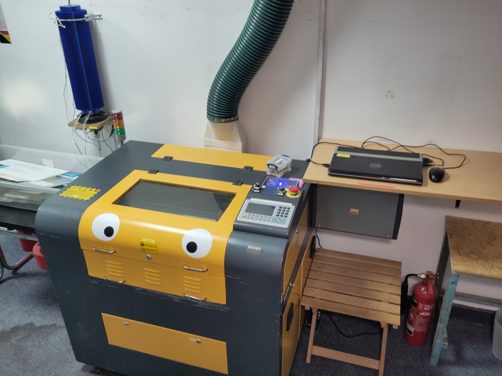

# Laser Cutter (Hoshiguma)

A laser cutter.
It cuts stuff using a laser.

## Essential Information

- Location: Ground Floor Corridor
- Responsible Person(s): Dan Nixon
- Induction Required: Yes

## Usage notes

> **It is not permitted under any circumstances to leave this machine running unattended!**

A list of compatible materials can be found [here](./materials.md).
A list of known good settings is [here](./settings.md).

To the left of the machine there is a black table.
This can be used for material preparation, finishing and sorting of machined pieces.
If you have machined anything particularly smelly, as a courtesy to other members, please do your finishing/sorting on this table and do not bring it into the main workshop.

To the right of the machine on the small table (under the PC shelf) is a waste bin for scraps that are no longer wanted but still potentially useful.
To the left of the machine on the floor is a bin for waste wood scraps that are not feasibly useful any longer.
See [waste streams](../../using_the_space/waste_streams.md) for more details.

## Troubleshooting

If the machine does any of the following, immediately stop using it, turn off both switched sockets on the wall behind the machine and let Dan know:

- illuminates all three status lamps at once
- leaks cooling water

## Induction checklist

- Turning on machine with fob, requirement for empty bed, emergency stop
    - the requirement to operate emergency stop when sustained fire occurs
- Panel controls
    - X/Y/Z axis motion
    - motion mode (central d-pad button)
    - pause/resume
    - stop
    - pulse
    - escape
    - fume extraction mode
- Note the fact that no other panel controls should be required under normal operation
- General laptop use, mention that personal laptops can be used and LightBurn discount available
- LightBurn
    - loading files
    - assigning layers
    - setting layer mode, speed, power, etc.
    - layer order
    - preview
    - origin selection/settings
    - frame
- Workpiece alignment and focusing
- Start/during/end of job processes, the requirement to attend the machine
- Turning off machine and laptop
- Available materials and waste streams in vicinity of machine
- Use of the vacuum cleaner to tidy the machine after use

## Statistics

For those who are curious, the following dashboards are available to show telemetry data from the laser cutter:

- [Overview](https://grafana.makerspace.org.uk/public-dashboards/fe9d271e85814020a9f9aa4444bb0a79)

These are only able to be accessed when at the space.
