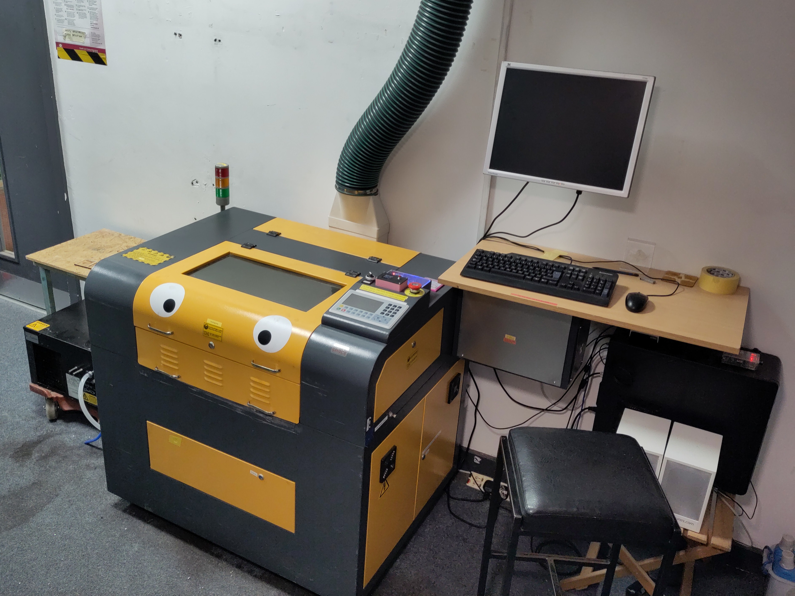

# Laser Cutter (Hoshiguma)

A laser cutter.
It cuts stuff using a laser.

## Essential Information

- Location: Ground Floor Corridor
- Responsible Person(s): Dan Nixon
- Induction Required: Yes

## Usage notes

> **It is not permitted under any circumstances to leave this machine running unattended!**

A list of compatible materials can be found [here](./materials.md).
A list of known good settings is [here](./settings.md).

> **Note:** both the safety/accessory control system and cooling system are currently being worked on (I know, top notch planning, right?).
> As such, please avoid doing very long (>20 minute) jobs without asking about how to reasonably do this first.

To the left of the machine there is a black table.
This can be used for material preparation, finishing and sorting of machined pieces.
If you have machined anything particularly smelly, as a courtesy to other members, please do your finishing/sorting on this table and do not bring it into the main workshop.

To the right of the machine on the small table (under the laptop shelf) is a waste bin for scraps that are no longer wanted but still potentially useful.
To the left of the machine on the floor is a bin for waste wood scraps that are not feasibly useful any longer.
See [waste streams](../../operational/waste_streams.md) for more details.
