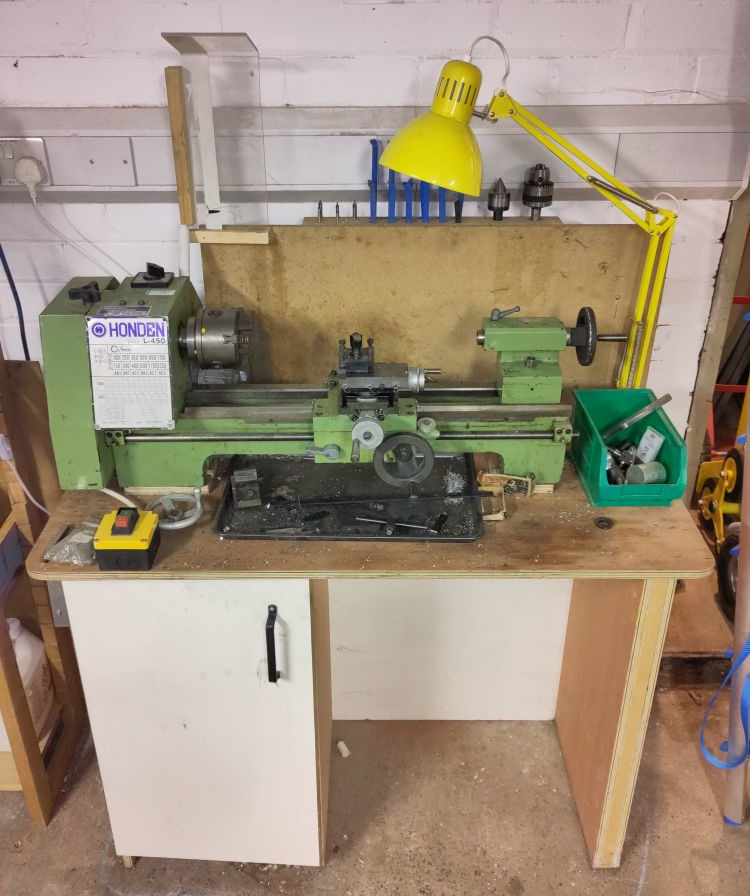

# Metal Lathe

We have a small "Model Engineers" style lathe generically known as a 9x20 (swing x length between centres).
It is capable of good work but as with many lathes in this class the lack of rigidity makes it prone to chatter if your cutting speed and/or tool sharpness isn't spot on.

Although classed as "Metal Turning" lathe it can be used to turn plastics and wood (making dowels out of scrap wood or plastic inserts/wheels are a couple of non metallic possibilities).

## Essential Information

- Location: North Basement Workshop
- Responsible Person(s): Malcolm G
- Induction Required: Yes

## Resources

The manual for this machine can be found [here](./manual.pdf).

A guide to replacing the bearings can be found [here](./bearing_replacement_guide.pdf).

## Ongoing Refurbishment

The lathe was acquired second hand and as such is been subject to semi continuous refurbishment although it is left in a usable condition whenever possible. Maintenance completed to date includes:

- Addition of guard
- Headstock rebuild and bearing lubrication
- Tailstock rebuild
- Saddle/slide rebuild and adjustment of gib strips
- Tool rack
- provision of general use set of tools
- addition of magnetic base to dial indicator to enable centring of work in the 4 jaw chuck
- Refurb/balancing of large grinder to facilitate lathe tool sharpening (see separate article on bench grinders)
- Replacement of idler and intermediate pulley bearings 
- Motor aligned so that toothed belt stays in position and low speeds are available
- Replacement of custom electrics with a standard NVR/stop switch

Remaining issues:

- the mounting table lacks rigidity and it is suspected mounting on a solid block (e.g. paving slab) might reduce chatter
- procurement of a fractional horsepower 3 phase motor would allow installation of a variable speed drive with added advantage of faster stopping time
- fabrication of jig to enable sharing of boring tools from the milling machine (one exists but is the wrong diameter)

Possible enhancements (only if there is a critical mass of interest)

- Addition of a headstock shaft encoder and stepper motor drive to the lead screw would allow flexible screw cutting
- Digital Read Out (DRO) on bed and cross slide 

## Essential Skills

Ideally we need to establish a larger core of members who are both competent and confident in the use of the lathe including essential skills:

- Understanding how to work safely and avoid danger
- Understanding the limits of the lathe and how to look after it
- Understanding the most common machining techniques

Typical techniques most people will need to know would include:

- methods of mounting materials (chuck types / faceplate use)
- drilling (including use of centre holes)
- use of tail stock centre for longer jobs
- appreciation of cutting speeds
- tool selection / sharpening
- typical cuts (e.g. facing / boring etc)

## Spare Parts
- Toothed Belt 170XL050: e.g. [https://simplybearings.co.uk/shop/p670999/170XL050-Major-Brand-Synchronous-Toothed-Belt-0.50-inch-Wide-17-inch-Length-85-Teeth/product_info.html](https://simplybearings.co.uk/shop/p670999/170XL050-Major-Brand-Synchronous-Toothed-Belt-0.50-inch-Wide-17-inch-Length-85-Teeth/product_info.html)
