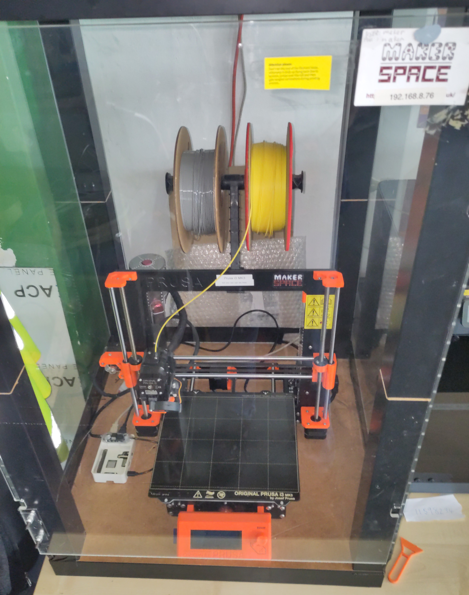

# Prusa MK3

A sort of OK FDM 3D printer.

## Essential Information

- Location: Ground Floor, Main Space
- Responsible Person(s): ?
- Induction Required: No

## Usage notes

> **It is not permitted to leave this (or any other) 3D printer running whilst Maker Space is unoccupied!**

This printer is fitted with a standard 0.4mm nozzle.

Octoprint is installed on a Raspberry Pi, which is capable of controlling and monitoring the printer over the network.
The IP address to access the Octoprint interface is on a label on the front of the printer.

If you'd rather print from the SD card, you might find it useful to create a folder with your name for your files.
Please remove any big files once you're done with them to save clogging the card up (same goes for Octoprint).

[PrusaSlicer](https://github.com/prusa3d/PrusaSlicer/releases) is generally the most straightforward way of slicing your files for printing, as it has a pre-made and tuned profile for the MK3.

If you don't know how to use a 3D printer, or if you're unsure of how to use the specific one in the space, please do ask someone before attempting to.
