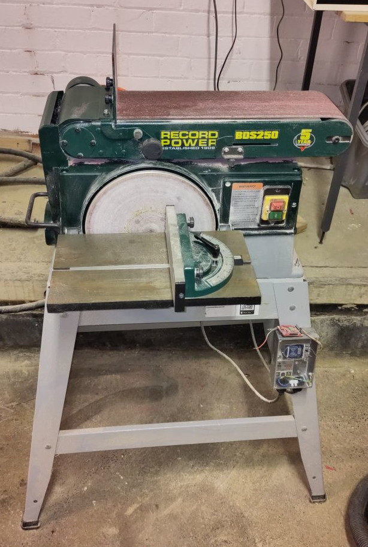

# Record Power Belt & Disc Sander

A Record Power BDS250 belt and disc sander.

## Essential Information

- Location: South Basement Workshop
- Responsible Person(s): Iain Yarnall, Dan Nixon
- Induction Required: Yes

## Usage notes

The manual for this machine can be found [here](./manual.pdf).

You will be expected to demonstrate the following competencies before gaining RFID access to this machine:

- Understand the need for protective eyewear for operator and observers.
- Understand the need to protect byestanders.
- Understand the safety implications of the belt and disc being linked.
- Be able to employ methods to prolong the life of the belt and disc.
- Understand which side of disc sander is safe to use.
- Be able to use the mitre fence on the disc sander.
- Understand how different parts of the belt can be used.
- Change orientation of the belt sander between horizontal and vertical.
- Adjust the tracking of the belt sander.
- Be able to clean the belt and disc.
- Understand the need to leave the sander in a safe and clean state for the next user.
- Understand the need to inform members and the maintainer if you consider the tool to be unusable/damaged or faulty.

## Spare Parts

- 250mm Self Adhesive Sanding Discs: e.g. [https://www.axminstertools.com/proxxon-self-adhesive-sanding-disc-250mm-80grit-ptk-5-477029](https://www.axminstertools.com/proxxon-self-adhesive-sanding-disc-250mm-80grit-ptk-5-477029)
- 150mm x 1,220mm Sanding Belt: e.g. [https://www.axminstertools.com/hermes-abrasive-belt-150-x-1-220mm-x-80-grit-110224](https://www.axminstertools.com/hermes-abrasive-belt-150-x-1-220mm-x-80-grit-110224)

- Belt Cleaner: e.g. [https://www.axminstertools.com/axminster-abrasive-belt-cleaner-standard-210-x-40-x-40-310398](https://www.axminstertools.com/axminster-abrasive-belt-cleaner-standard-210-x-40-x-40-310398)
