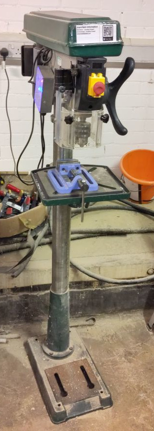

# Record Power Drill Press

A Record Power DP58P floor standing drill press.

## Essential Information

- Location: South Basement Workshop
- Responsible Person(s): Dan Nixon
- Induction Required: Yes

## Usage notes

The manual for this machine can be found [here](./manual.pdf).

You will be expected to demonstrate the following competencies before gaining RFID access to this machine:

- Understand the need for protective eyewear for operator and observers.
- Understand the need to protect byestanders.
- Be aware of the risks of wearing gloves while operating the pillar drill.
- Be able to change a drill bit.
- Understand what the guard is and the importance of using it (and that it disables the machine when flipped up).
- Be able to adjust table height and secure it.
- Understand the need for appropriate work holding (and scrap board underneath the work to avoid drilling the table etc.).
- Be able to use the depth stop .
- Be able to change belt speeds.
- Understand the need for different drill speeds.
- Understand the need to leave the drill in a safe and clean state for the next user.

A useful speed chart can be found [here](http://images.meredith.com/wood/images/pdf/speedchart.pdf).
