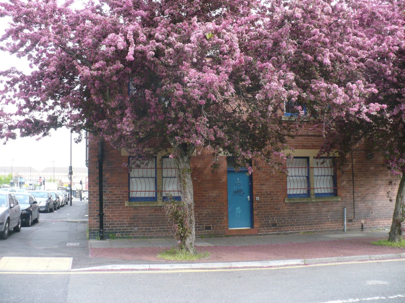

# MS1 Photos

## External

The space was accessed from the door shown below on Coquet Street.  Our room was to the left of the door.

## Internal

Here are some photos from inside the space.

And a panorama!

## Demolition

The building has since been demolished.  This was the state of MS1 in February 2021.

