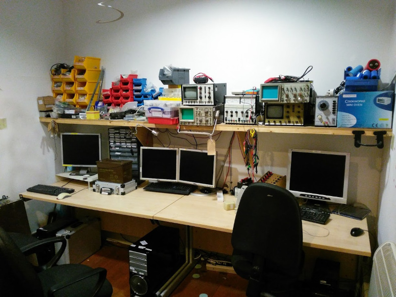
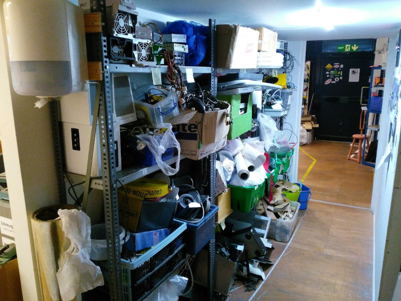

# MS2 Photos

## External

MS2 had 2 entrances.  A front door with a disabled ramp on New Bridge Street West (right) and a side door (left) leading into the main workshop.

## Internal

### Main Workshop

### Machine Room

### Computer Lab

### Members' Storage

### Hack Me Shelves

### Wet Lab

### Demolition

