# MS3 Photos

## External

A 3D printed model of the building

[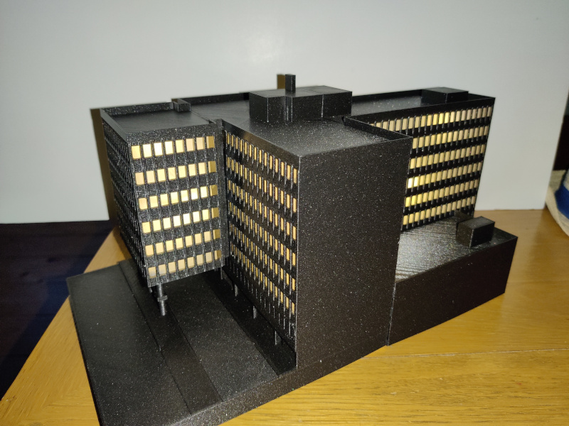](./images/ms3_model.jpg)

The entrance to the space from within the underground car park

[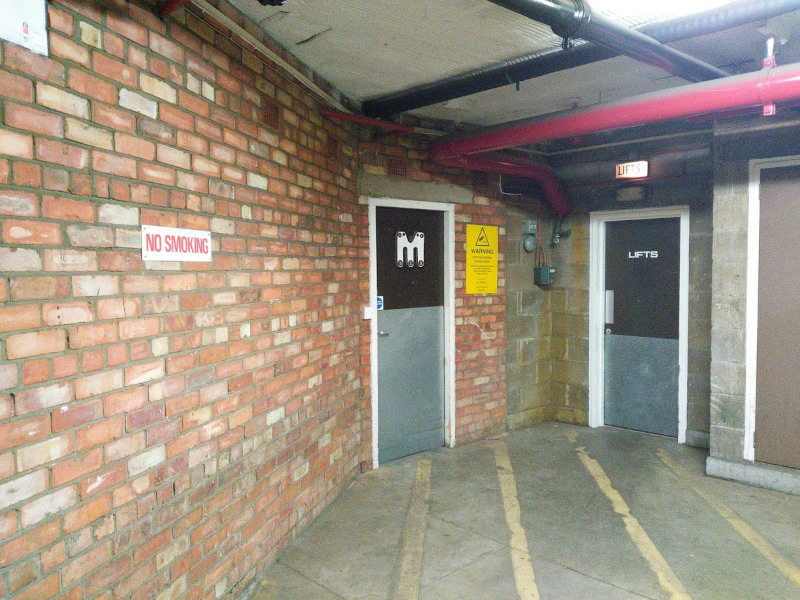](./images/ms3_entrance.jpg)

## Internal

### Main Workshop

[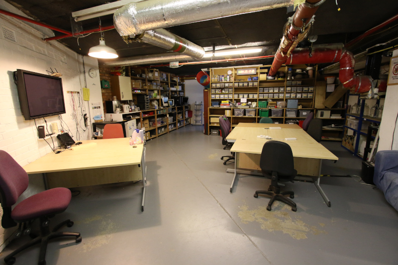](./images/ms3_workshop1.JPG)

[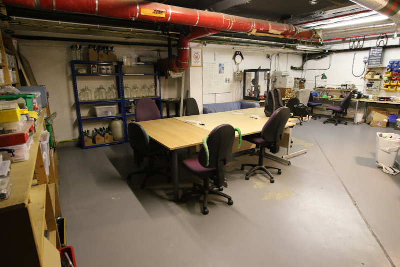](./images/ms3_workshop2.JPG)

[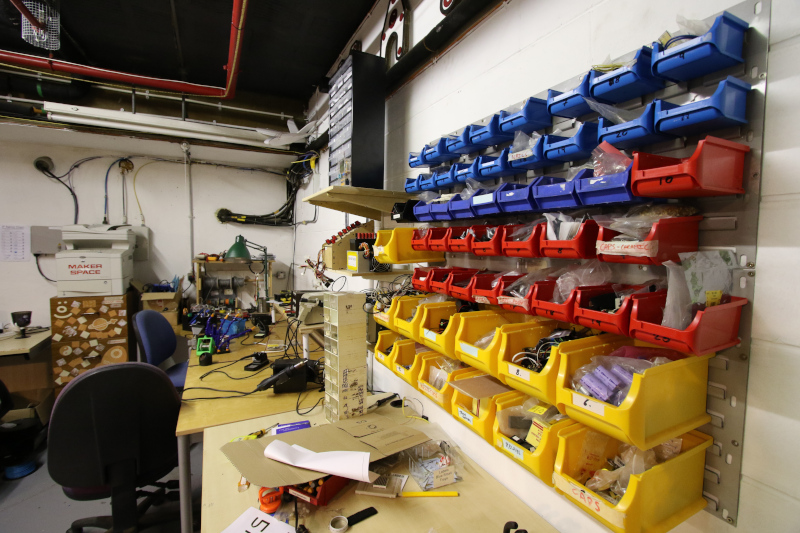](./images/ms3_workshop3.JPG)

[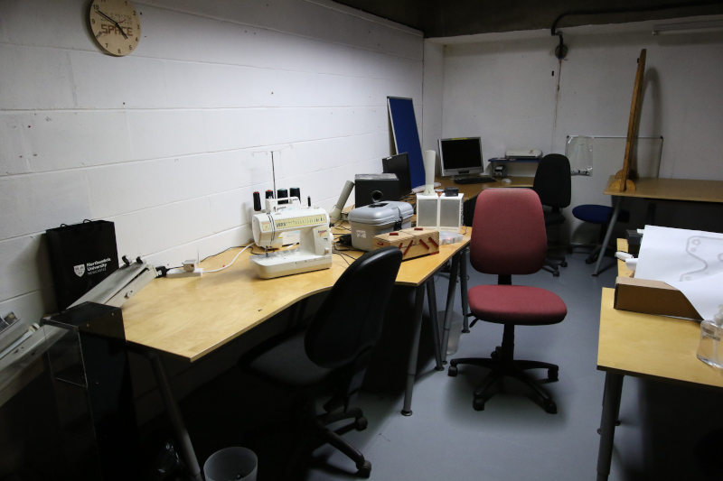](./images/ms3_workshop4.JPG)

Part of the drone racing circuit in the main workshop.

[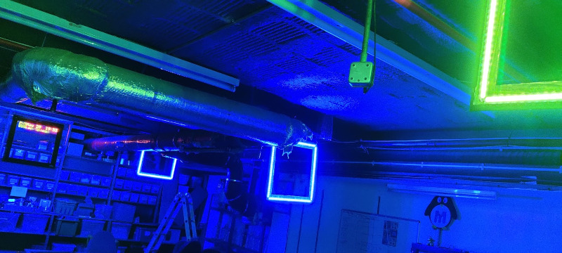](./images/ms3_drone_gates.jpg)

### Machine Room

[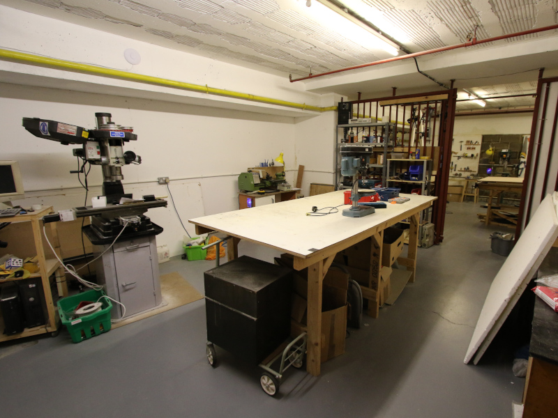](./images/ms3_machine_room1.JPG)

[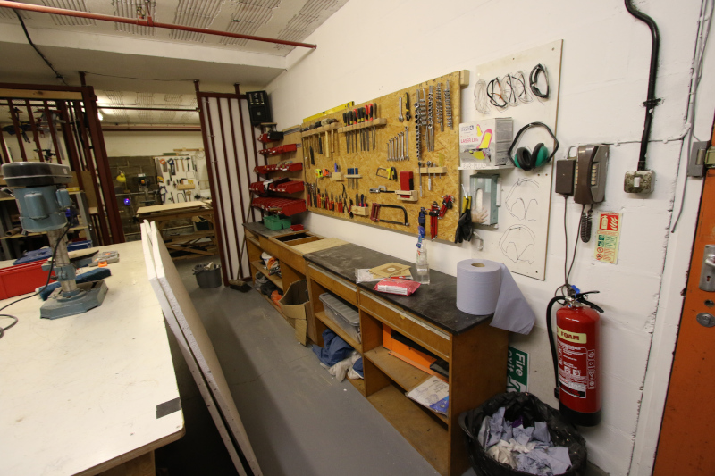](./images/ms3_machine_room2.JPG)

[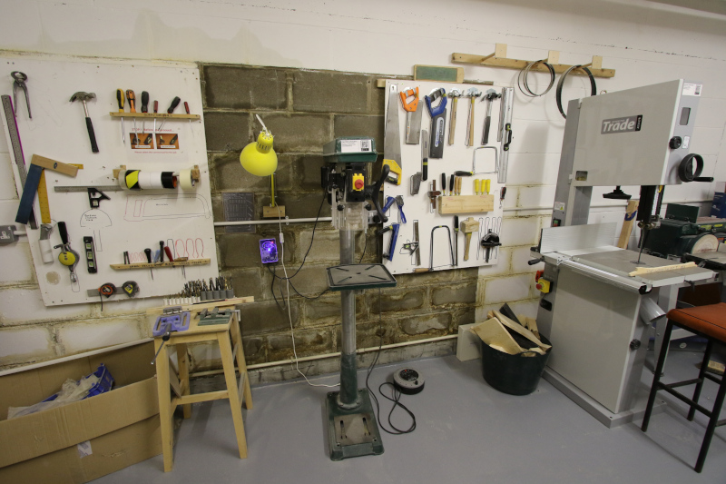](./images/ms3_machine_room3.JPG)

[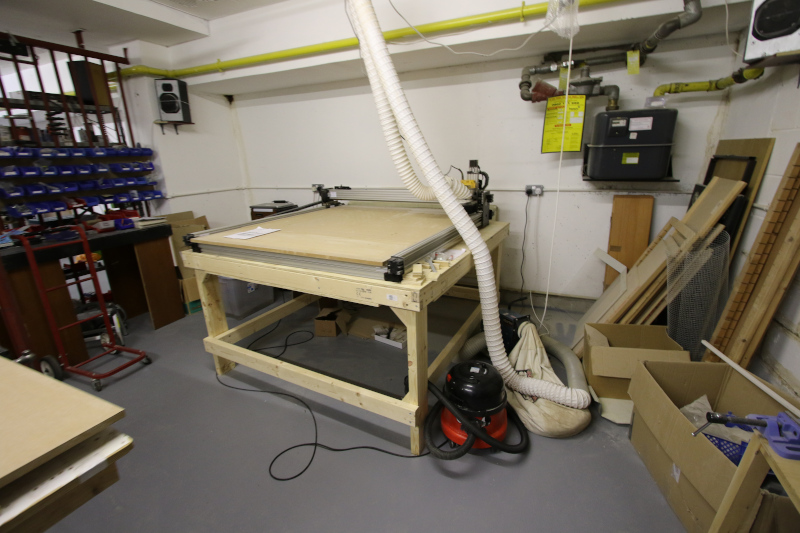](./images/ms3_machine_room4.JPG)

### Laser Annex

[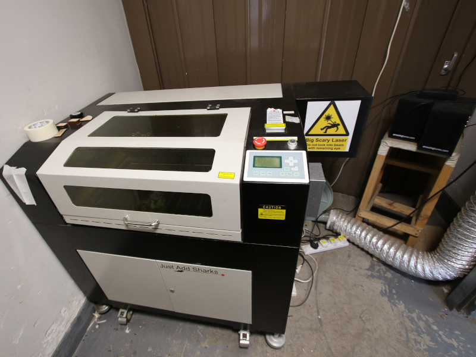](./images/ms3_laser.JPG)

## Demolition

[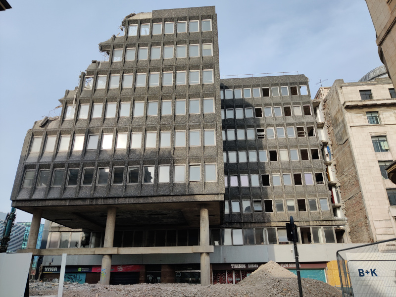](./images/ms3_demolition1.jpg)

The white walls visible below were where MS3 was.

[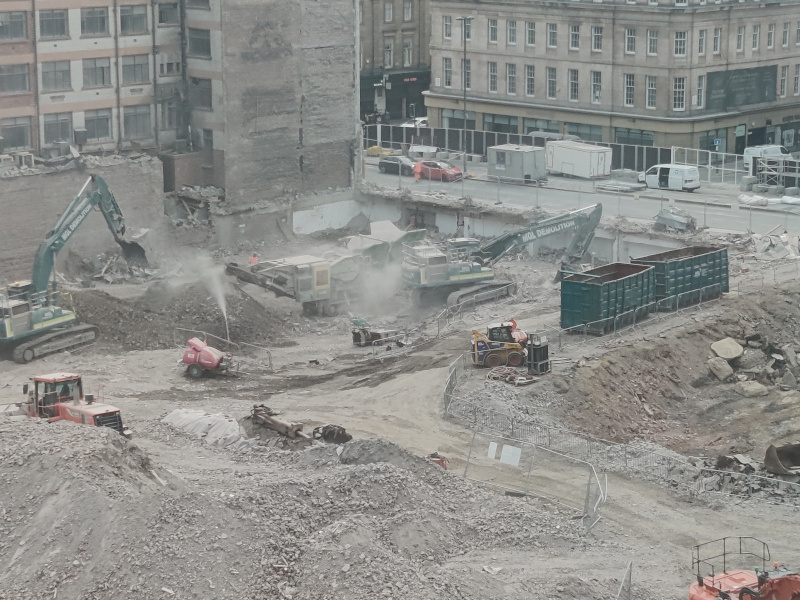](./images/ms3_demolition2.jpg)
