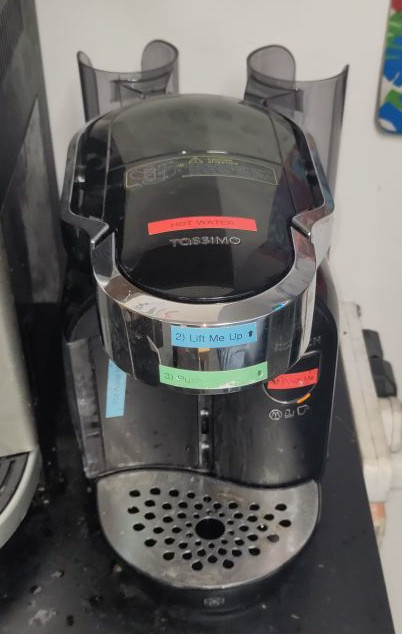

# Modified Bosch Tassimo machine

A Bosch Caddy TAS70 Tassimo drinks machine that has been modified to produce ~90C water.

You can still use it for making Tassimo drinks, as long as you enjoy creating a waste product that contains four waste streams and is a pain to separate and not widely processed.

## Essential Information

- Location: Ground Floor Workshop
- Responsible Person(s): Dan Nixon

## Getting water

1. Turn the machine on via the switch on the right hand side
1. Lift/open the Tassimo disc loading bay lid
1. Close the Tassimo disc loading bay lid
1. Push big button (it is a little sticky, ensure it does not get stuck in)
1. ???
1. Water appears (hope you put your mug under the spout)

Currently you cannot control the temperature or quantity of the water.
Maybe you will be able to in the future (but probably not...).

## Resources

- [Manual](./manual.pdf)
- [Quick Start Guide](./quick_start.pdf)
- Discs
    - [Service Disc](./discs/service.pdf)
    - Drinks
        - [L'or Americano Classique](./discs/lor_americano_classique.pdf)
        - [Kenco Americano Grande XL](./discs/kenco_americano_grande_xl.pdf)
