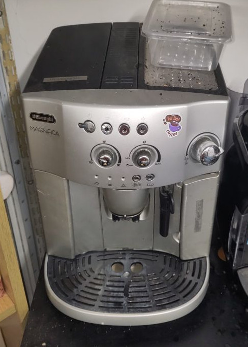

# DeLonghi Magnifica coffee machine

We now have a coffee machine that makes (generally) pretty good coffee.  

It's a bean to cup machine, which means you put whole coffee beans in, and it will grind them and make coffee.

It's a DeLonghi Magnifica ESAM4200 S.EX1, and the manual can be found [here](./manual.pdf).

## Essential Information

- Location: Ground Floor Workshop
- Responsible Person(s): David Pye

## Coffee Bean Supply 

It's new to us, so we haven't got everything straightened out yet.
At the moment, the Space has not yet decided to fund the purchase of beans ( and might not, depending on the cost, and the level of interest).

So there are a few options we can discuss:

- The coffee drinkers can buy beans in turn (or every now and again) so we all have access to coffee.
- Keep a bag of beans in your box, and throw a handful into the machine when you want coffee.  (discourages freeloaders...!)
- We could discuss, once we know likely usage/cost, whether the space might fund the beans like it does tea. But if it's much more expensive, it's not necessarily fair.
- We could have a coffee kitty and set a price for a cup.

## Using it/Troubleshooting

Warning: Beans go in the grinder hopper at the top. Water goes in the pull out water container.
Putting water in the grinder hopper will cause much distress to the maintainers. 
We've spent an evening overhauling the seized grinder after someone poured water in it, and it rusted solid.

### Procedure

- Water goes in the water tank to the right. Tuck the milk frother spout in so its' out of the way, and pull the water tank forwards, refil (note the MAX mark) and replace.
- Coffee beans go in the hopper on the top left under the black cover. 
- The two silver dials - the one on the left sets the amount of water i.e. volume, the one on the left sets the amount of coffee - ie strength.
- It makes espresso, so you probably want to press the two-cup button at the top to make a mug of 'latte/cappuccino' etc.
- Press the top right button (with the picture of steam above it) to activate the steamer. When it's solid red, crank the steam knob half a turn anticlockwise to start steaming.  A milk jug is provided.  Please wash the jug and the removable spout after use.

### Most common warning/status lights:

- Bottom left: Needs water - top it up.
- 2nd from left: Empty the grounds container.  Gently hinge the centre section out, and pull the drip tray mechanism OUT.  The grounds container is at the back. Ask someone to show you if you're not sure, it's difficult to describe in writing!
- Middle one: 'generic error'.  Might be the centre section door not shut properly. Else, it's broken. Bugger. Tell David Pye/post on -admin mailing list.
- 2nd from right: blinking - needs descaling.
- Far right: ECO light. Should be on. Don't press the button to turn it off, it won't turn off automatically, and will waste power.
