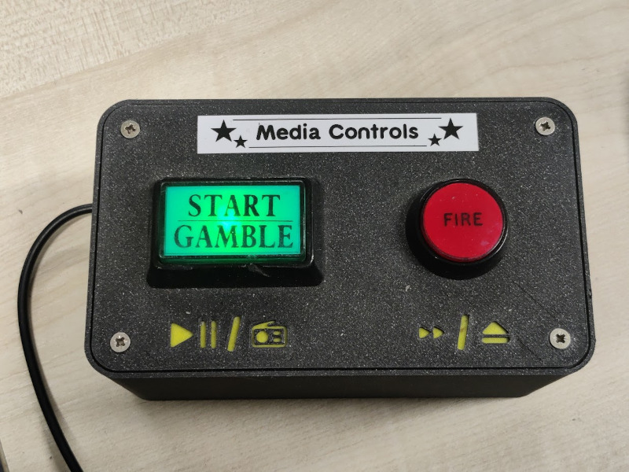

# Music Server

The music server is running Logitech Media Server (LMS) on a Raspberry Pi using PiCorePlayer.
There are currently 2 players, one in the main room and one in the basement.

## Essential Information

- Responsible Person(s): Iain Y

## Controlling the music

There are several ways to control the players:
- Using the media control buttons.
- Using the touchscreen mounted on the green pillar in the main room.
- Using [http://mediaserver:9000](http://mediaserver:9000/) on a web browser whilst connected to the space WiFi.
- Using a compatible mobile app e.g Squeezer [https://play.google.com/store/apps/details?id=uk.org.ngo.squeezer](https://play.google.com/store/apps/details?id=uk.org.ngo.squeezer)
    - Alternative Android Apps [https://wiki.slimdevices.com/index.php/Remote_control_apps_for_Android.html](https://wiki.slimdevices.com/index.php/Remote_control_apps_for_Android.html)
    - Alternative iPhone Apps [https://wiki.slimdevices.com/index.php/IPhone_control.html](https://wiki.slimdevices.com/index.php/IPhone_control.html)

## Media Control Buttons

There are Media Control buttons for each player:
- In the main workshop, on the second bank of desks.
- In the basement, in the corner of the South side, next to the amplifier.

### Green (Play/Gamble) button:

Short Press = Play/Pause - If there is nothing in the playlist it will start random play.

Long Press (2 Seconds) = Switch the Favourites (which should contain a list of radio stations).

If the light is flashing, it should indicate the music is paused, it should be fully on whilst playing.

### Red ("Fire") button

Short Press = Skip Track

Long Press (2 Seconds) = Clear the current playlist.

>The light comes on when you press the button and goes off when the Long Press is reached.

### Amplifier control

In the main workshop, the amplifier is switched on and off by the Media Control Buttons based on the status of the player.  The controller 

 
In the basement, the amplifier must be switched off manually when not in use.

## Adding music to the server

The music is stored on a share on the server at the following location: `\\mediaserver\music\`

Music can be in MP3, OGG, FLAC, WAV or WMA.

The folder structure should follow Artist > Album > Tracks.

Tracks should be properly ID3 tagged before being copied into this area.
A tag editor can be used to edit your files e.g. [http://www.softsea.com/review/ID3-Tag-Editor.html](http://www.softsea.com/review/ID3-Tag-Editor.html).