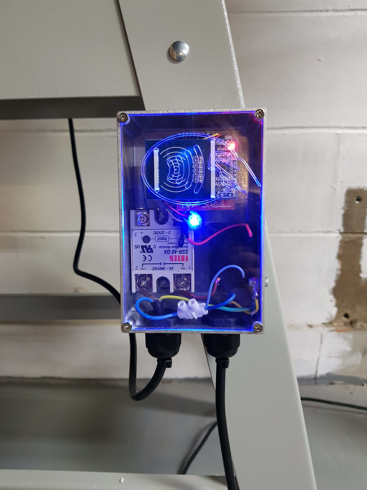

# RFID Access Controllers

This page contains a brief run-down of the RFID access controller used to control the members door entry system as well as expensive, or hazardous machinery.

## Essential Information

- Responsible Person(s): David Pye

## User instructions

|LED colour|Meaning  |Notes|
|----------|---------|-----|
|Blue      |Idle     |Associated device is locked and the access controller is waiting for a tag to be presented.|
|Yellow    |Verifying|Presented tag is being checked against an updated allowlist.|
|Green     |Allowed  |Presented tag was on the allowlist and the associated device is unlocked. **Remember to log out once you are finished with the machine by presenting your tag again.**|
|Red       |Denied   |Presented tag was not on the allowlist and the associated device remains locked.|
|Magenta   |Offline  |Controller has no network access and is running in offline mode. Cached tags will still unlock the associated device.|

Note: If you present an RFID that isn't known to the controller, the LED will briefly go yellow - it checks with the backend server that the database is up to date (ie has this RFID just been added to the list of valid users?) then either green or red, depending on the result.

If the controller appears to remain blue when an RFID is presented, this is most likely because it cannot read it - those small RFID jewellery rings are sometimes prone to this, as the RFID reader boards aren't always sensitive enough to pick them up.

For access to the door, this should be covered in your member induction, otherwise mention it to whoever did your induction.
For access to machinery, this is handled when you receive your induction on the machine in question.

> **Note:** The access controllers are part of the space infrastructure.
> Hacking them (especially to gain access to a tool you are not permitted to use) will be viewed very seriously, and may result in sanctions.

## Technical details

- The controller is powered from a Chinese/Ebay 240v->5VDC (isolated - allegedly...!) power module.
- The main 'brain' is an ESP8266 (ESP-12) board, mounted to a custom-designed PCB, containing a 5v->3v3 linear voltage regulator, jumper for run/program mode, FET for triggering a relay, and several rows of pins for connections.
- RFID reader - MFRC522 RFID reader board for reading MiFare NFC cards or similar
- SSR - the access controllers are using Fotek SSRs (nominally rated at 40a, but their pedigree is questionable and they may not actually be able to run at this full rated current)
- LED - a 'NeoPixel' addressable LED for status updates

### Sequence of events

Init:

- Controller powers up, connects to backend server. 
- Checks its' flash-held database is in sync with the online copy by checking it's MD5 hash with the MD5 hash of the current server copy. This is done using the HTTP/1.1 ETag function.  If the hashes are the same, the databases are in sync.
- If not the LED will remain yellow, the remote database is downloaded, and programmed into flash on the controller.
- The LED will then go blue waiting for an RFID card to be presented.

Valid card (known to local db);

- SSR enabled. LED to green. MQTT message broadcast to MQTTPi in space. Log message sent to backend server.

Possible invalid card: (not in local db):

- Quick check again to see if DB up to date.  If not, download remote DB, program to flash and then check again.
- If card now in database, proceed as above. If not, pause few seconds with red LED shown (denied) then proceed to blue awaiting a valid RFID to be presented.

Logout:

- When the LED is green (ie device unlocked), *ANY* rfid will lock it and sign out the current user. 
- SSR off, LED->blue for resting state, MQTT message and remote log message is sent.
