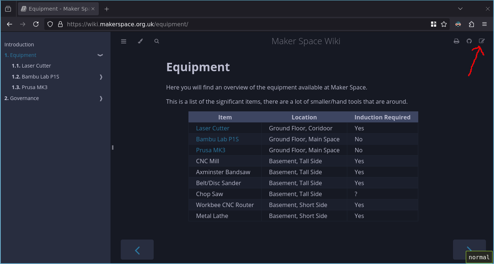
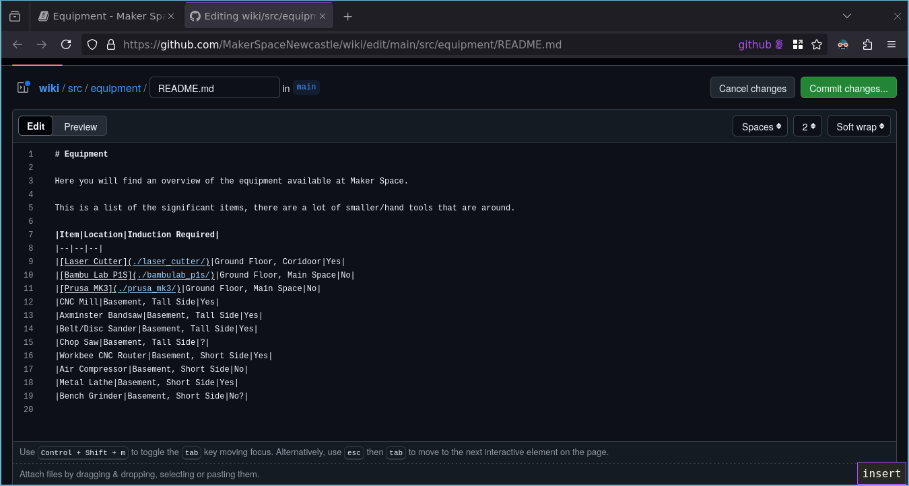
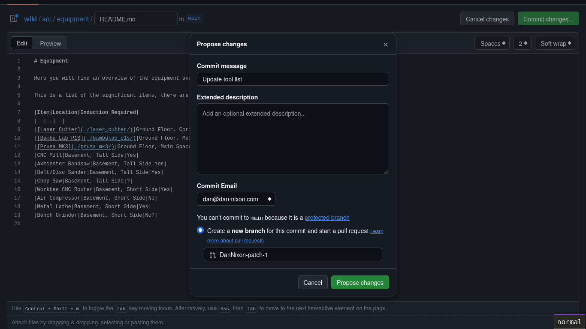
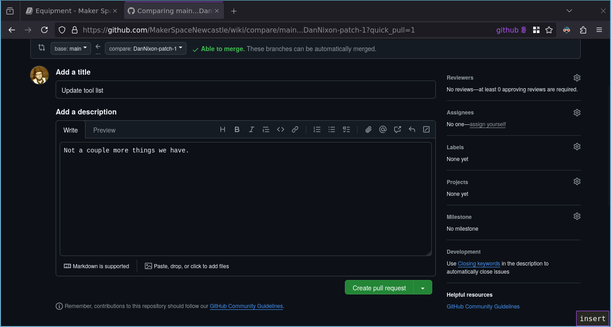
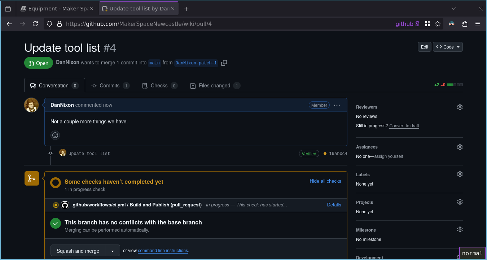
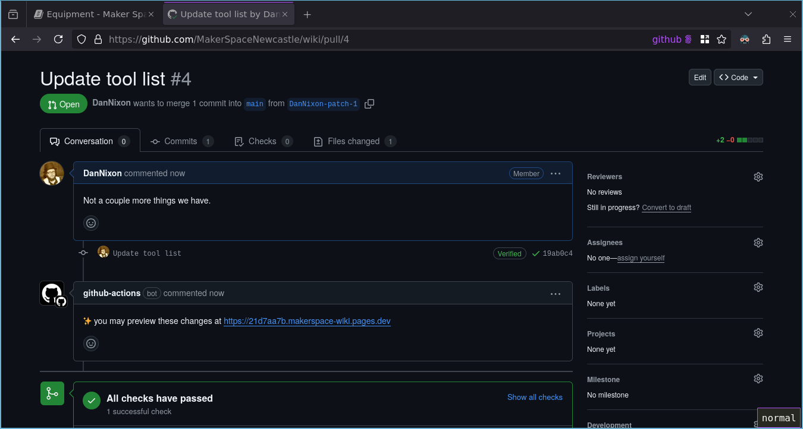
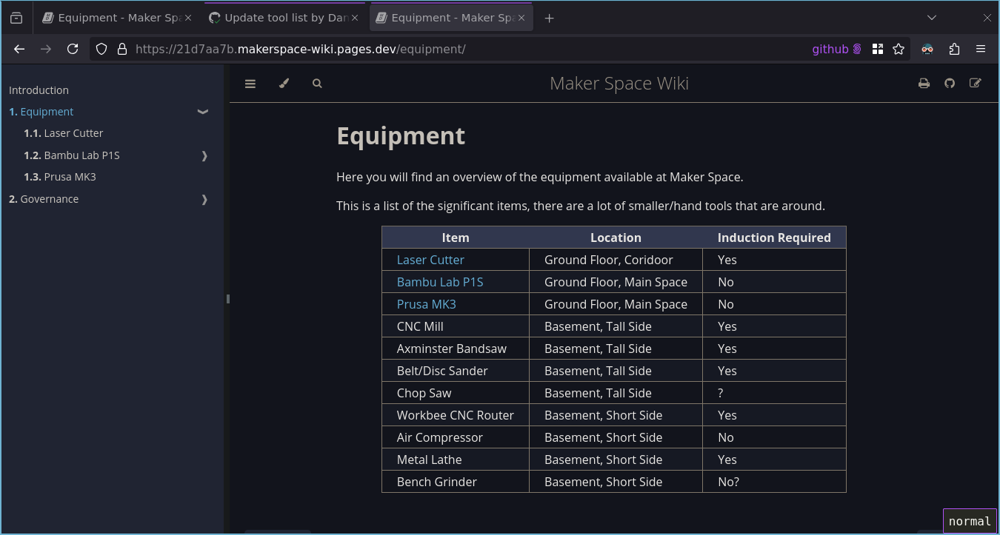
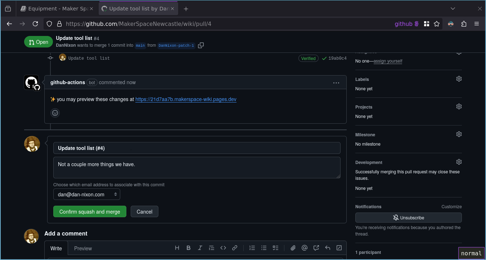
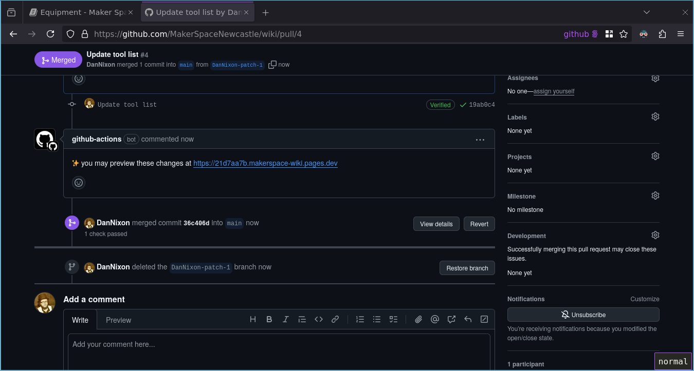

# Contributing to the wiki

This outlines the means of editing the wiki.

If you are familiar with Git, then you can likely skip most of these docs, [install mdBook locally](https://rust-lang.github.io/mdBook/guide/installation.html) and contribute as you would to any other project.
The one caveat is that if you wish to use the CI generated previews then you must not work from a fork of the [MakerSpaceNewcastle/wiki](https://github.com/MakerSpaceNewcastle/wiki) repository (you do not need to as being a member of the MakerSpaceNewcastle organisation gives you write permission to this repository).

Relevant parts of the mdBook documentation to reference are:

- [`mdbook serve`](https://rust-lang.github.io/mdBook/cli/serve.html)
- [`SUMMARY.md`](https://rust-lang.github.io/mdBook/format/summary.html)
- [Markdown](https://rust-lang.github.io/mdBook/format/markdown.html)
- [mdBook-specific features](https://rust-lang.github.io/mdBook/format/mdbook.html)

## Prerequisites

- A [GitHub](https://github.com/) account
- Be a member of the [MakerSpaceNewcastle](https://github.com/MakerSpaceNewcastle/) GitHub organisation
- [Git installed](https://git-scm.com/downloads) and configured (if following [Locally via Git clone](#locally-via-git-clone))
- [mdBook installed](https://rust-lang.github.io/mdBook/guide/installation.html) (if following [Locally via Git clone](#locally-via-git-clone))

## Single page via the GitHub web UI

This will walk through making a change to a single page of the wiki.

In this example, let's assume you wish to add a couple more tools to the equipment page, only adding them to this list, not creating their description pages.

1. On the page, click the edit icon in the top right hand corner:

   

2. This will take you to the online text editor on GitHub (if you are not already signed in then you will be asked to).
   Make the desired changes (in this case the addition of the air compressor and bench grinder to the list) and click the green "Commit changes..." button.

   

3. You will be asked to provide a commit message, type something descriptive here and click the green "Propose changes" button.

   The remaining options may be left as their defaults.
   If the options provided to you look different to the above then verify you have satisfied the [prerequisites](#prerequisites).

   

4. You will be taken to the create pull request screen, proceed to [Proposing changes via a Pull Request](#proposing-changes-via-a-pull-request).

## Locally via Git clone

Note that these instructions are quite brief for the time being.

1. Clone the [wiki repository](https://github.com/MakerSpaceNewcastle/wiki).
2. Inside the repository, run `mdbook serve`. This will start a local web server that will update the site live as you make changes.
3. Make your changes via your text editor/IDE of choice.
4. Commit the changes to a new branch.
5. Push the branch.
6. Open a pull request, proceed to [Proposing changes via a Pull Request](#proposing-changes-via-a-pull-request).

## Proposing changes via a Pull Request

1. Provide a suitably descriptive title and description of your changes and click the green "Create pull request" button.

   

2. One the pull request has been opened, you will see the actions start to run.
   This will build the site and deploy a preview of it.

   

3. Once the actions have completed, you will see a comment appear with a link to preview the changes.

   

4. Opening the link in the comments and browsing to the equipment page shows the changes made.

   

5. Depending on exactly what has been changed in the pull request, certain people may have automatically been requested to review your changes, if so they must provide their reviews first.
   You may also opt to ask people to review your changes if desired.

   Otherwise you can now click the green "Squash and merge" button, followed by "Confirm squash and merge" to accept the proposed changes.

   

6. The pull request is closed, the live wiki will now update.

   
