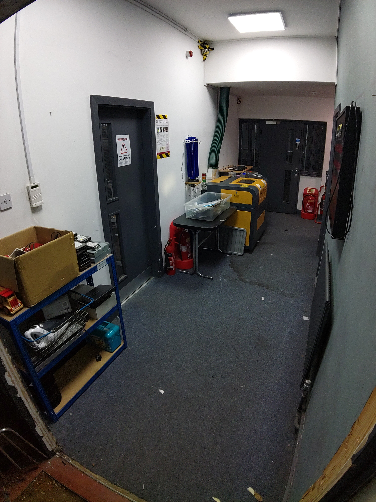

# Ground Floor Corridor

As you step into this industrial haven, the corridor unfolds before you—a seamless blend of practicality and aesthetics.
The heartbeat of this workspace, the corridor stretches like a silent river, connecting different realms within the building.
It’s not merely a passageway; it’s a conduit of creativity and collaboration.

At one end of the corridor, behold the pièce de résistance - the laser cutter.
Its sleek metallic frame stands like a sentinel, ready to transform raw materials into precision-cut masterpieces.
The hum of the extraction adds a symphonic undertone to the corridor’s rhythm.

