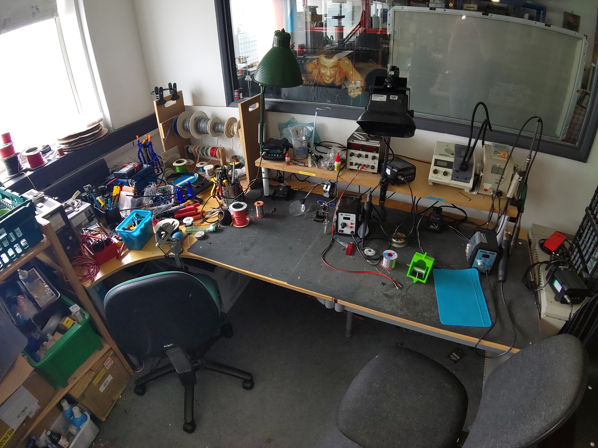
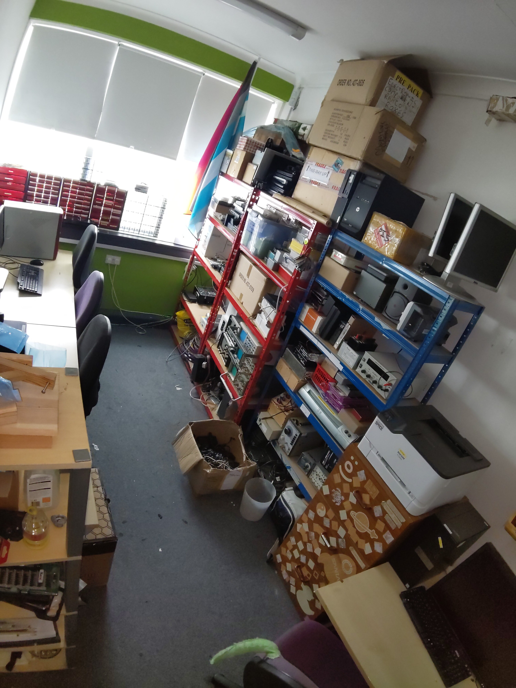
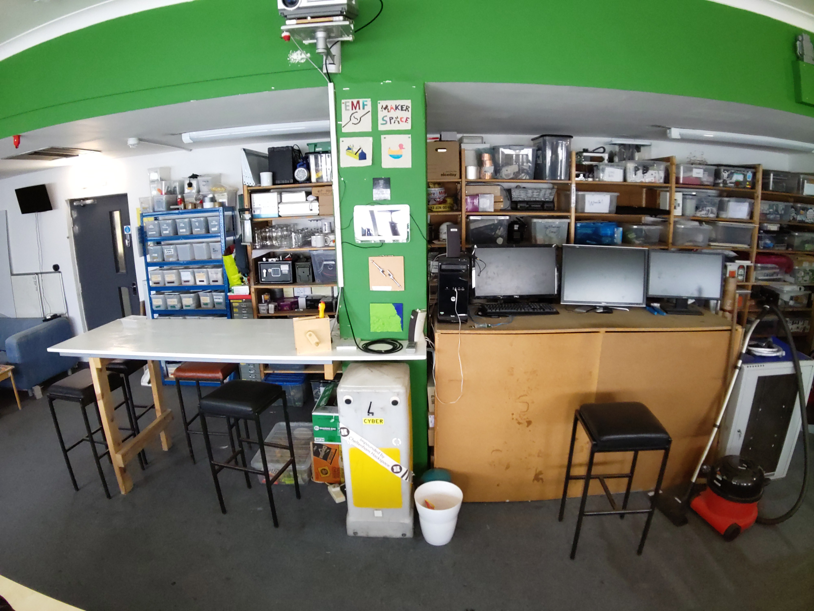

# Ground Floor Workshop

Step into this vibrant hub of innovation, where imagination takes tangible form.
Our main workshop is more than just a room - it's a canvas for your wildest ideas.

Picture a symphony of activity.
The main workshop sprawls across the floor, partitioned into multiple work areas.
Whether you're assembling a PCB or making tote bags, there's a spot for your creative endeavors.

Our electronics workspaces, a place where wires tangle like ivy, components sprawl like fallen leaves, and soldering irons hum like caffeinated bees.

The soldering stations wear battle scars. Burn marks, flux residue, and tangled solder wicks - they tell tales of countless connections forged.
The air smells of molten dreams and a hint of desperation.

Dive in, untangle wires, and let sparks fly.
Who knows? Your next invention might emerge from this delightful chaos.

In our cosy goldfish bowl you will find several PC workstations - each a digital canvas awaiting your command.
These machines hum with potential, their screens reflecting the glow of countless projects.

Currently we have two general purpose machines: one Ubuntu 24.04 and one Windows 10, and one dedicated CAD machine running Windows 10, where 3D models take shape, and blueprints come alive.
Whether you're designing a futuristic skyscraper or a whimsical teapot, these stations empower your vision.

Each wall of the room is clad in a labyrinth of industrial shelving.
Each shelf cradles a universe of components, parts and tools.

Welcome to the hackspace lounge, a tranquil corner where making takes a breather.

Behold at what some consider the most critical items in the space: our tea and coffee making facilities.
The aroma of freshly brewed chai mingles with the robust scent of freshly ground beans.
Choose your potion: tea or double-shot espresso?
Both enjoyed from the Royal Doulton with the hand-painted periwinkles.

Nestled against the wall, our plush sofa beckons.
Sink into its embrace - a refuge for tired hackers and dreamers alike.
Whether you're pondering the next steps for your current project or just need a power nap, this sofa cradles your thoughts.

Open the fridge, and you'll find a treasure trove: cold brews, artisanal sodas, and perhaps a rogue slice of leftover pizza.
It’s like Narnia, but with more caffeine.
But please note some items belong to members or cost money if you'd like to consume them.

The bookcase stands tall, its shelves sagging under the weight of knowledge.
Dusty hardcovers, dog-eared paperbacks, and a few mysterious tomes - they’re all here.

The storage wall is a vast expanse of shelving, stretching from floor to ceiling, each unit brimming with a variety of tools, components, and materials.
Every inch is utilized to its fullest potential, packed full of tools, parts and materials just waiting for the right project to come along.

The south side of this shelving is dedicated to storage for member's personal items.

Welcome to the vibrant hub of creativity within this dynamic hackspace: the breakfast bar.
This inviting space is designed to foster collaboration and provide a comfortable spot for members to create and connect.

The breakfast bar table is a sleek, modern fixture, crafted from high-quality materials that blend functionality with style.
It's spacious surface offers ample room for enjoying a quick snack, tinkering on a project, or engaging in lively discussions about the latest projects and ideas.
The bar stools, with their ergonomic design, ensure comfort during those longer brainstorming sessions.

Strategically located within the hackspace, this area is bathed in natural light, creating a warm and welcoming atmosphere.
The surrounding decor is thoughtfully curated to inspire creativity, with vibrant artwork and innovative designs adorning the walls.

Whether you’re taking a break from a challenging project or simply looking to network with fellow makers, the breakfast bar table area is the perfect spot.

Adjacent to the breakfast bar is the cutting-edge communication hub within the hackspace: the amateur radio setup.
This area is meticulously designed for enthusiasts and hobbyists who are passionate about radio technology and communication.

This amateur radio setup is more than just a collection of equipment; it's a gateway to a world of communication and exploration.
Whether you're a seasoned operator or new to the hobby, this space is designed to inspire and support your passion for radio technology.

Step into this exceptional amateur radio setup and experience the thrill of global communication right from the heart of our hackspace!

Here we have our 3D printing station.
This area is a dream come true for any maker, featuring top-of-the-line equipment that promises precision and reliability.

To the left, you’ll find the renowned Prusa MK3.
Its user-friendly interface and reliable performance make it an indispensable tool for both beginners and seasoned professionals.

Complementing the Prusa MK3 is the cutting-edge Bambu Lab P1S.
This advanced 3D printer is celebrated for its speed and versatility, capable of producing high-quality prints in a fraction of the time.
With its sleek design and state-of-the-art features, the Bambu Lab P1S is perfect for those looking to push the boundaries of their creativity.

The 3D printing station is thoughtfully arranged to maximize efficiency and inspire innovation.
Each printer is strategically positioned to allow for seamless workflow, with ample workspace for preparing and finishing prints.
The station is well-lit and equipped with all the necessary tools and materials, ensuring that every project can be executed to perfection.

