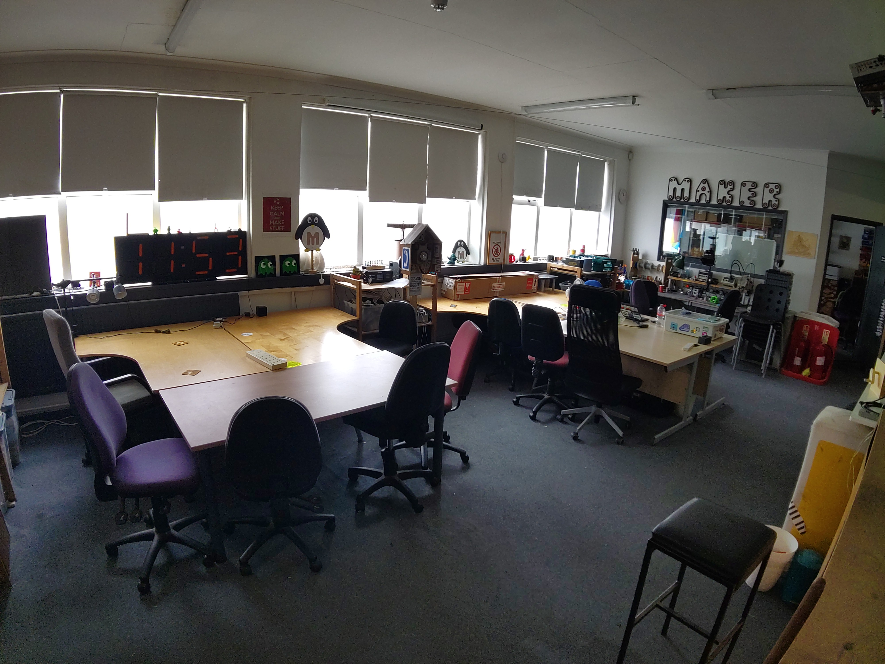
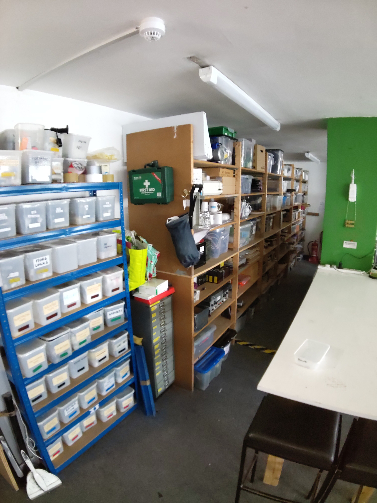
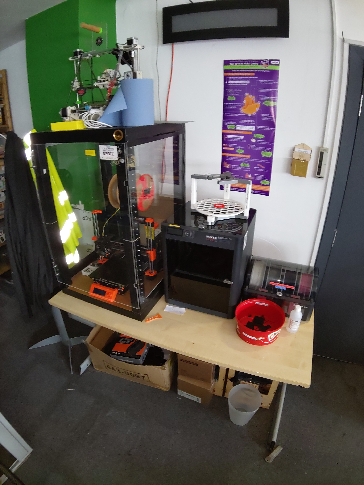

# Ground Floor Workshop

Step into this vibrant hub of innovation, where imagination takes tangible form.
Our main workshop is more than just a room - it's a canvas for your wildest ideas.

Picture a symphony of activity.
The main workshop sprawls across the floor, partitioned into multiple work areas.
Whether you're assembling a PCB or making tote bags, there's a spot for your creative endeavors.

Our electronics workspaces, a place where wires tangle like ivy, components sprawl like fallen leaves, and soldering irons hum like caffeinated bees.

The soldering stations wear battle scars. Burn marks, flux residue, and tangled solder wicks - they tell tales of countless connections forged.
The air smells of molten dreams and a hint of desperation.

Dive in, untangle wires, and let sparks fly.
Who knows? Your next invention might emerge from this delightful chaos.

In our cosy goldfish bowl you will find several PC workstations - each a digital canvas awaiting your command.
These machines hum with potential, their screens reflecting the glow of countless projects.

Currently we have two general purpose machines: one Ubuntu 24.04 and one Windows 10, and one dedicated CAD machine running Windows 10, where 3D models take shape, and blueprints come alive.
Whether you're designing a futuristic skyscraper or a whimsical teapot, these stations empower your vision.

Each wall of the room is clad in a labyrinth of industrial shelving.
Each shelf cradles a universe of components, parts and tools.

Welcome to the hackspace lounge, a tranquil corner where making takes a breather.

Behold at what some consider the most critical items in the space: our tea and coffee making facilities.
The aroma of freshly brewed chai mingles with the robust scent of freshly ground beans.
Choose your potion: tea or double-shot espresso?
Both enjoyed from the Royal Doulton with the hand-painted periwinkles.

Nestled against the wall, our plush sofa beckons.
Sink into its embrace - a refuge for tired hackers and dreamers alike.
Whether you're pondering the next steps for your current project or just need a power nap, this sofa cradles your thoughts.

Open the fridge, and you'll find a treasure trove: cold brews, artisanal sodas, and perhaps a rogue slice of leftover pizza.
It’s like Narnia, but with more caffeine.
But please note some items belong to members or cost money if you'd like to consume them.

The bookcase stands tall, its shelves sagging under the weight of knowledge.
Dusty hardcovers, dog-eared paperbacks, and a few mysterious tomes - they’re all here.

todo

todo

todo

todo
