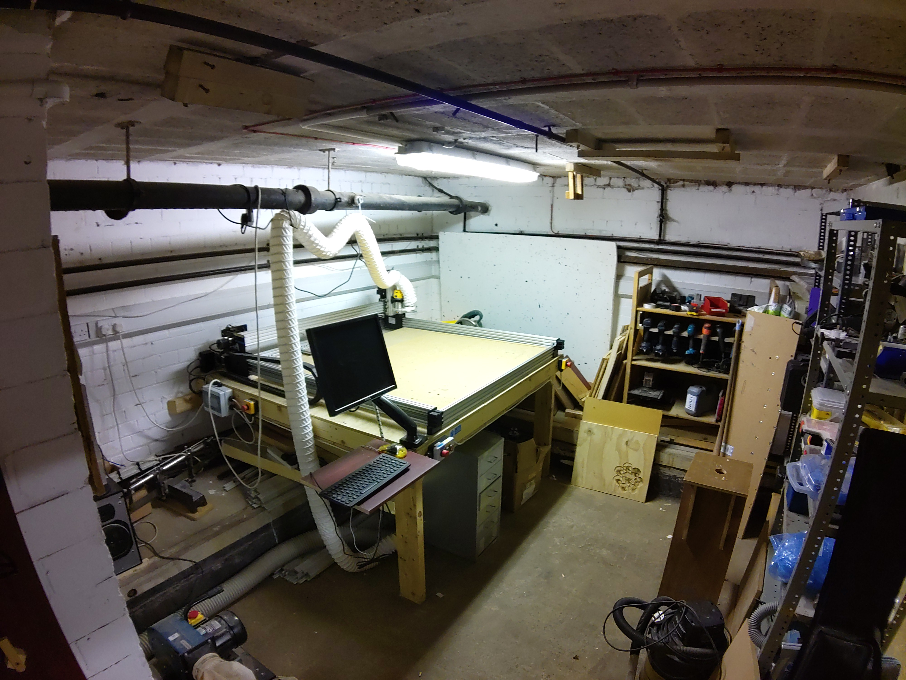
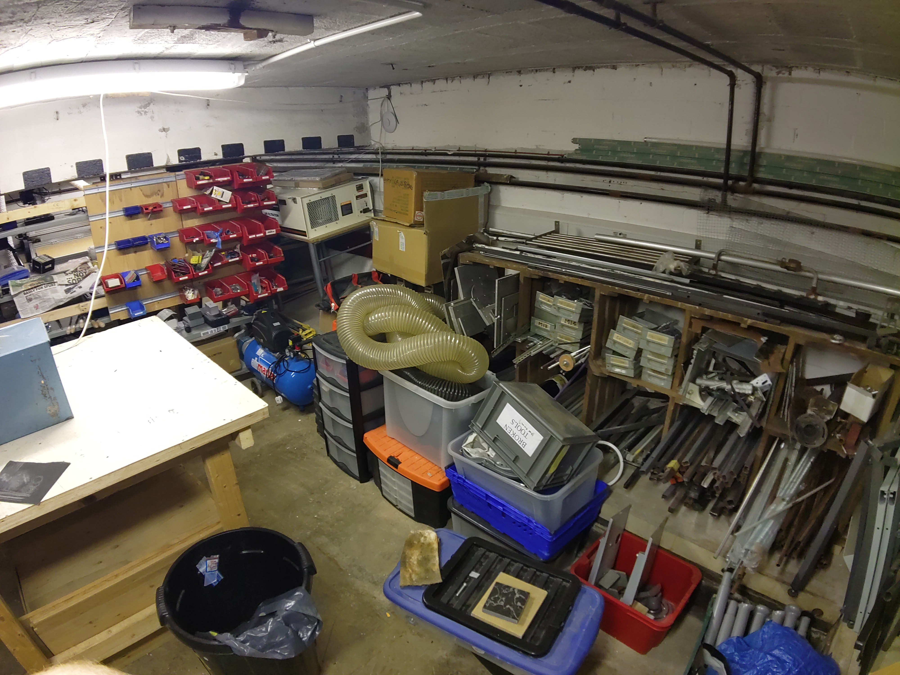

# North Basement Workshop

Welcome to the cutting-edge corner of the basement workshop, where innovation meets precision.
This dedicated area features the highly sought-after Workbee CNC router, a must-have for any serious maker or woodworker.
The Workbee CNC router is the centerpiece of this corner, known for its accuracy and versatility. It’s perfect for intricate carvings, precise cuts, and complex designs.
The intuitive control system and software make it accessible for both beginners and experienced users, allowing for seamless operation and creativity.

Welcome to the meticulously curated hand tool collection within our vibrant hackspace.
This essential area is a treasure trove for any maker, offering a diverse range of tools that cater to all your crafting and repair needs.
Tools are neatly arranged on shelves and in toolboxes, making it easy to find exactly what you need quickly and efficiently.
As part of our hackspace, this collection benefits from the collective knowledge and experience of our members, who are always willing to share tips and techniques.
Regular maintenance ensures that all tools are kept in optimal condition, ready for use whenever inspiration strikes.

Welcome to the dedicated metalworking area within our innovative hackspace, a haven for metal enthusiasts and craftsmen alike.
This well-appointed section is designed to cater to all your metalworking needs, featuring a top-of-the-line metal lathe as its centerpiece.
The star of this area is a high-precision metal lathe, perfect for turning, facing, and threading a variety of metals. Its robust construction and advanced features ensure accuracy and reliability for all your projects.
Alongside the lathe, you'll find an array of essential metalworking tools, including cutting tools, calipers, micrometers, and more, all meticulously maintained for optimal performance.

Against the rear wall, you will find yet another of our storage areas.
These sturdy storage shelves, strategically placed against the wall, are designed to keep your tools and materials neatly arranged and easily accessible.

Against the adjoining wall you will discover the metal stock storage.
This dedicated space is designed to cater to the needs of metalworking enthusiasts, ensuring that all materials are stored efficiently and safely.
Metals are neatly categorized by type and size, making it easy to locate the exact material you need for your project.
Whether you require aluminum, steel, copper, or brass, everything is clearly labeled and accessible.
Conveniently located adjacent to the main metalworking area, the metal storage section allows for quick and easy access to materials, streamlining your workflow.

At the center of this dynamic space stands a robust and versatile workbench, designed to be the focal point for all your metalworking projects.
This workbench is built to withstand the rigors of heavy-duty metalworking, featuring a solid frame and a thick, durable work surface.
Equipped with a high-quality vice, the workbench ensures secure clamping of materials, allowing for precise and stable work.

