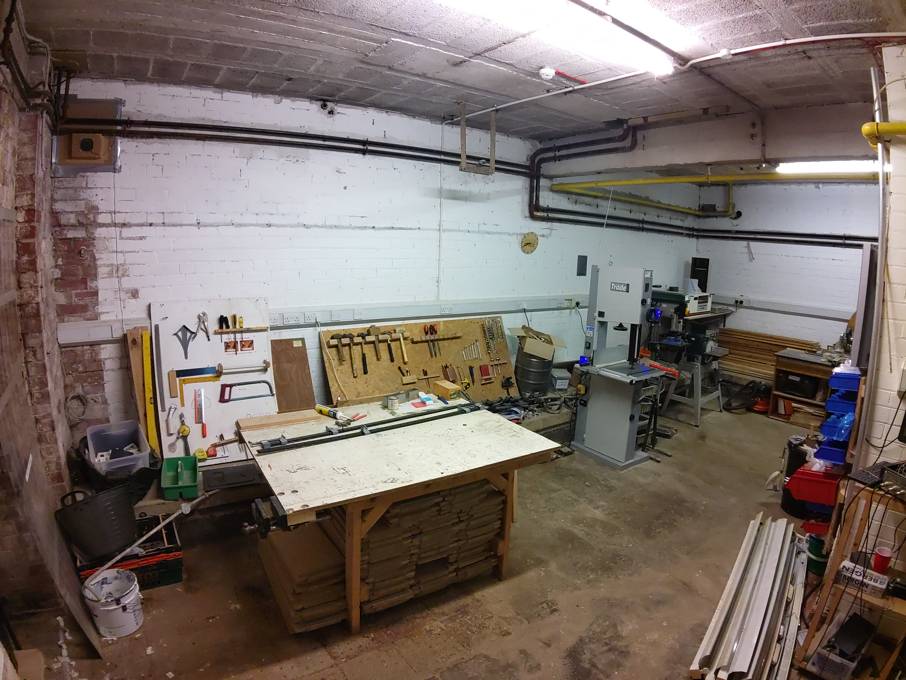
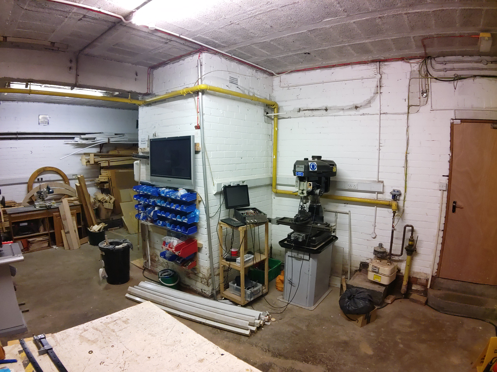
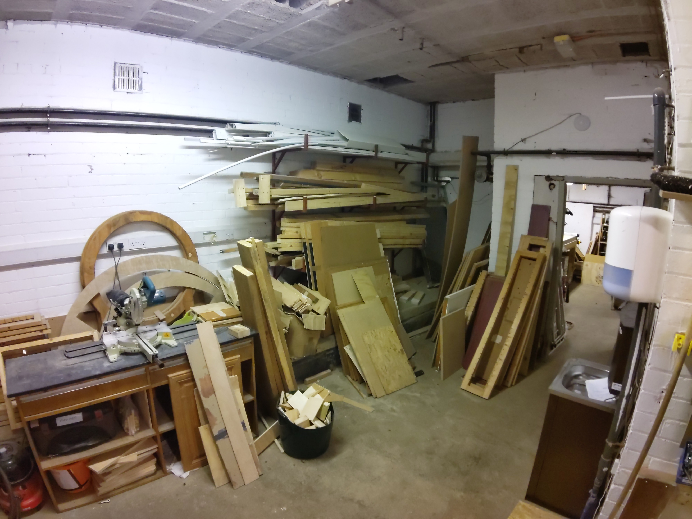
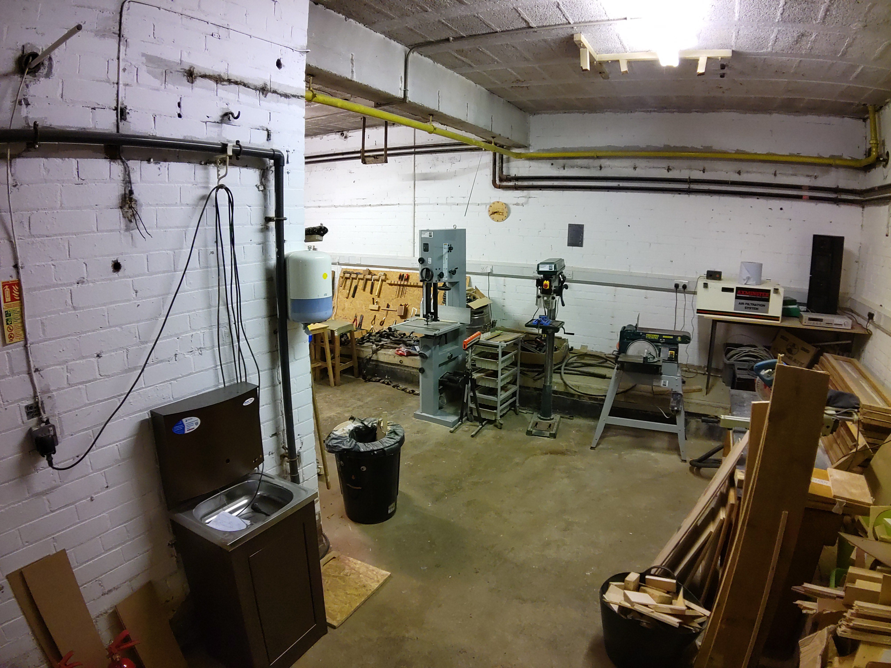

# South Basement Workshop

todo

todo

todo

todo

todo

The metal bins harbor an orchestra of fasteners. Hex nuts, wing nuts, carriage bolts—they jostle for attention. And the washers? They’re like tiny time-traveling saucers, ready to stabilize your contraptions.
